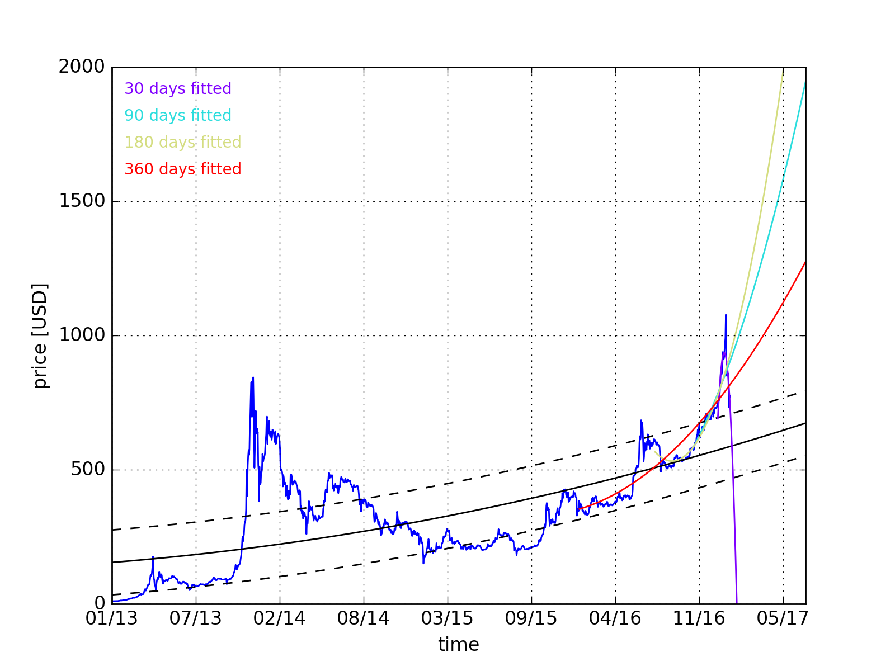

blockchain-playground (📈🐍)
===

> playing around with different blockchain stats and learning python

<!-- TOC depthFrom:1 depthTo:6 withLinks:1 updateOnSave:1 orderedList:0 -->

- [Getting started](#getting-started)
	- [Prerequisites](#prerequisites)
	- [Installation](#installation)
	- [Run](#run)
- [Projects](#projects)
	- [price-fit](#price-fit)
	- [spent-bitcoins](#spent-bitcoins)
- [License](#license)

<!-- /TOC -->

# Getting started
## Prerequisites

You need to have `python` and a package manager (e.g. `miniconda`) that brings you `pip` installed. The code is tested on python `3.5.2` only.

## Installation

Each sub-projects has to be installed manually by running `pip` in the respective folder

```bash
pip -r requirements.txt install
```

## Run

Run the index file after installation with `python index.py`.

# Projects

## price-fit

> fit price data and extrapolated



* get latest bitcoin market price data
* plot regression with mean deviations as expected min/max values

## spent-bitcoins

> play with python APIs and caching

* scrapes [blockchain.info](https://blockchain.info/api) block infos
* counts how many outgoing coins are marked `spent`
* caches blocks to redis

This one needs a **redis** instance available on your system. You can use `docker-compose up -d` in the main dir to bring up a dockerized (persistent) cache via docker.

# License

MIT © [Andreas Offenhäuser](http://anoff.io)
